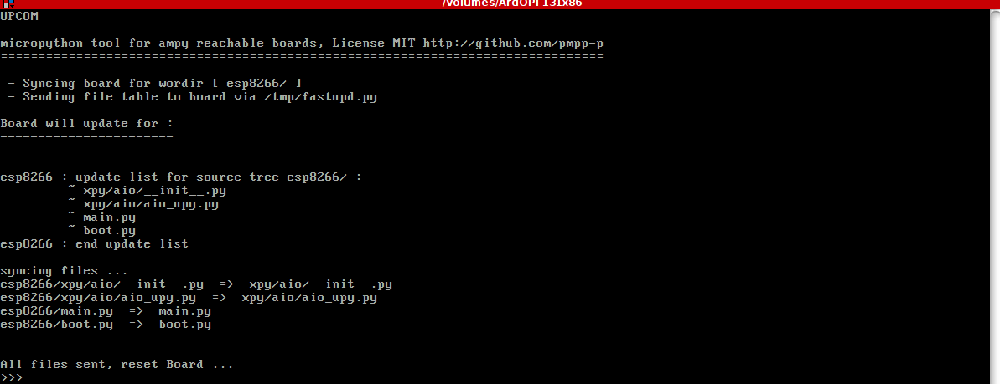

# stupyde
studio-upython-ide, but KISS

workflow is:

    build hashmap (sha1) of your source tree.

    set date on board in case not using ntp.

    make sure asyncio is stopped to enter raw repl.

    send hashes and directories structure to the board via uart wrapped a in small micropython script.

    let the board compute from the file it already has and reply with a missing/changed list on uart.

    stupyde then drives ampy for you and only send changed/missing files, then reset the board and connect to REPL

requires your favorite text editor ( eg: Tilde https://github.com/gphalkes/tilde ).

requires a vt-100 terminal ( eg: mlterm for sixel support, terminator for tiling , h3droid sdk runtime).

requires python3.7 ( for f-strings conversion with https://github.com/pmp-p/fstrings_helper ).

requires ampy https://github.com/adafruit/ampy for talking to boards.

everything else is bloat and will be kept optionnal.

usage example:

    WORKDIR=./esp8266 ./stupyde/upcom.sh /dev/ttyUSB0

Ctrl+Q to leave terminal

tests are made on : GNU/Linux & H3Droid, python 3.7.1rc1 and esp8266
